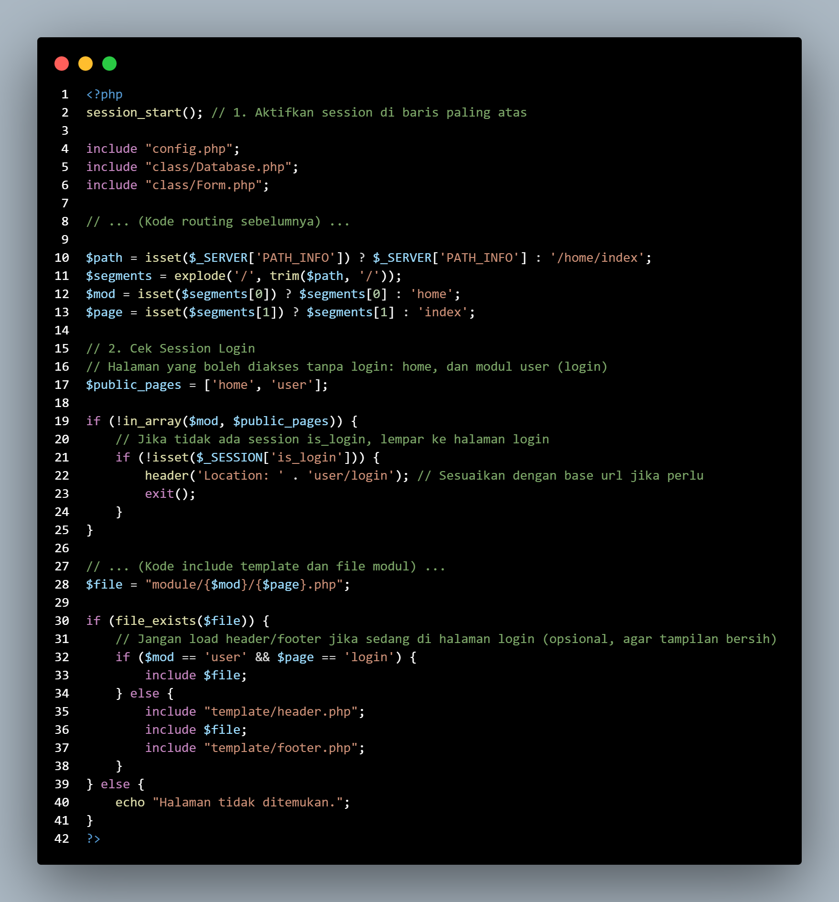
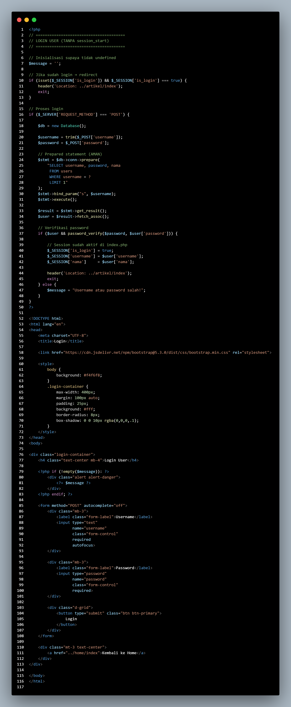
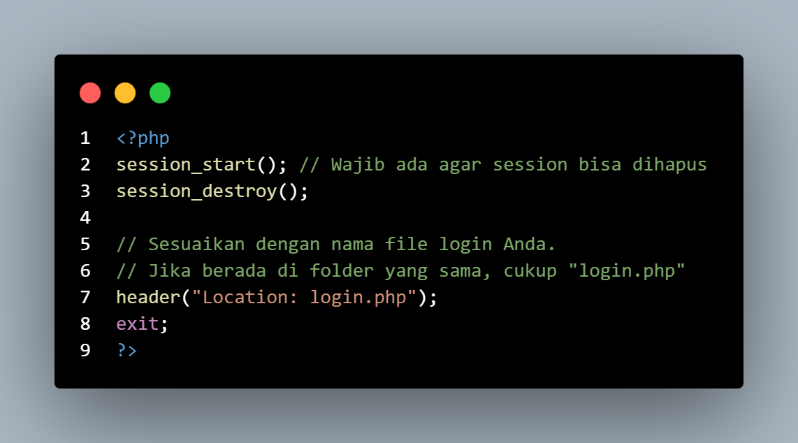
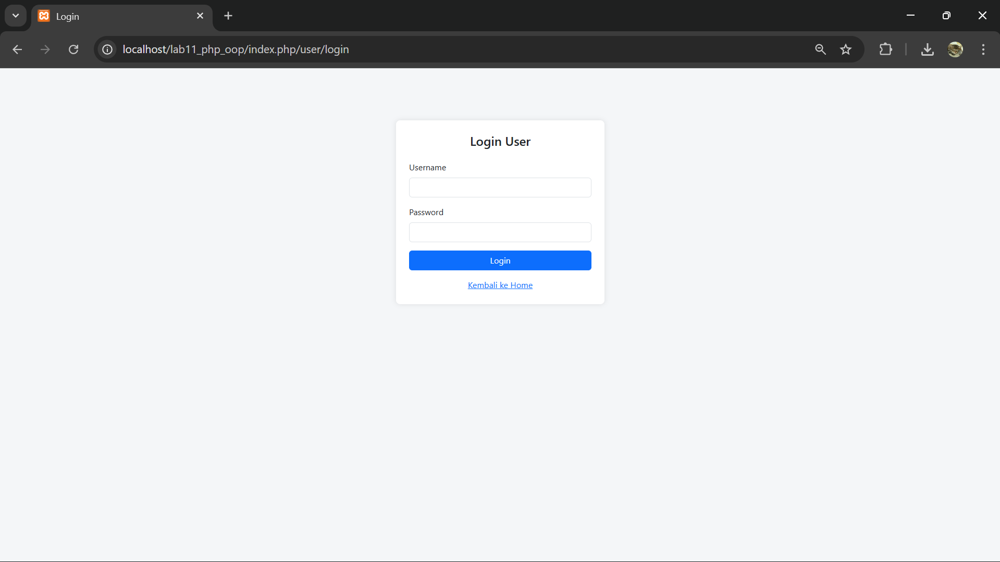
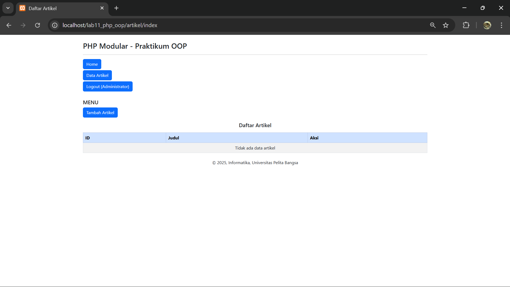
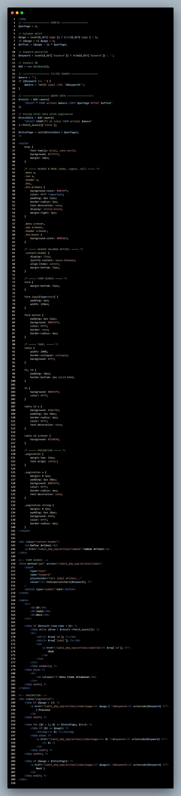
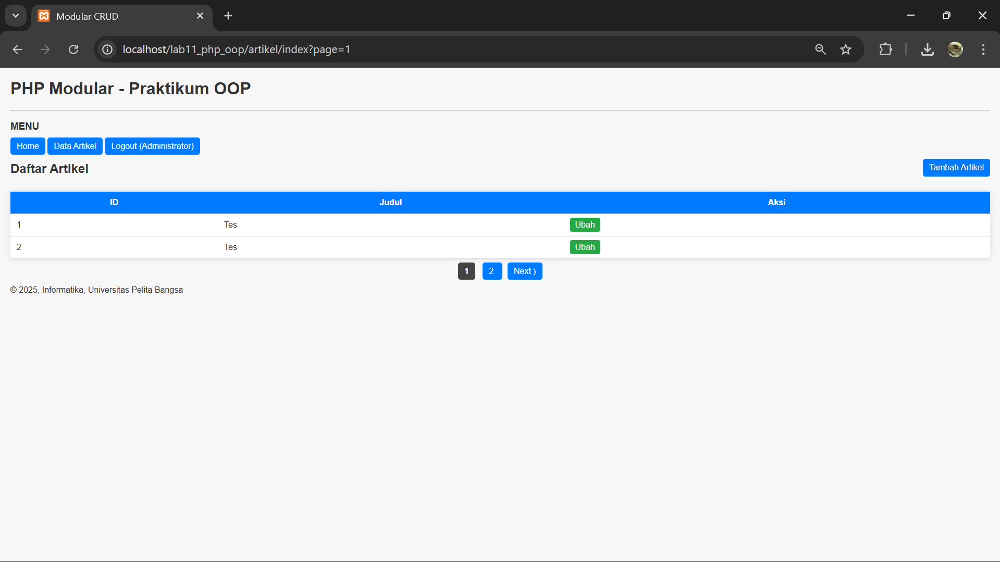
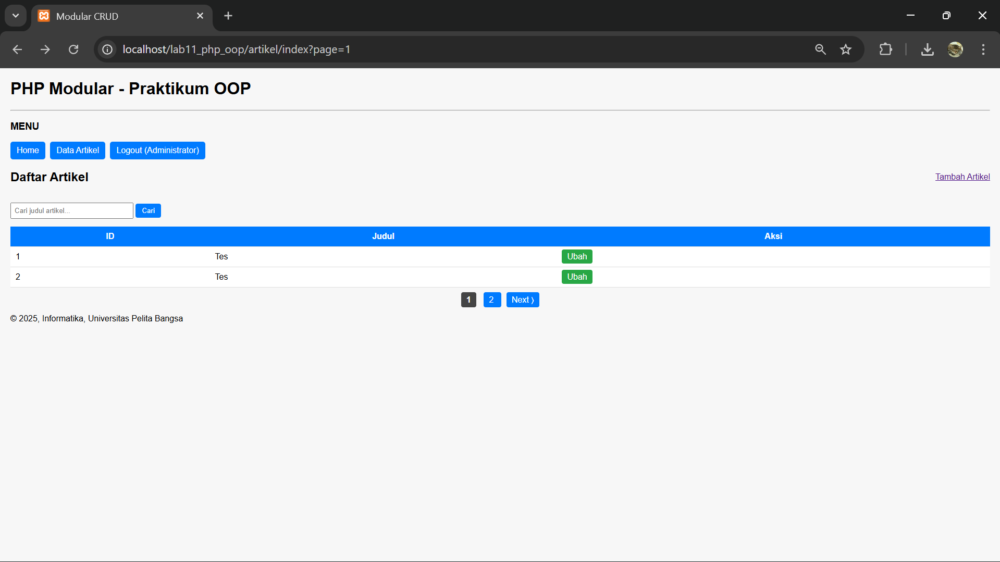

# Pratikum 11: PHP OOP
### NAMA : Raihan Ardiansyah
### NIM : 312410396
### KELAS : TI.24.A3

**Langkah-langkah Praktikum**

- A. Persiapan Struktur Folder

Langkah 1: Pindahkan file Database.php dan Form.php (dari praktikum sebelumnya) ke
dalam folder class/.

- File: form.php

- File: database.php

- B. Konfigurasi Dasar

**Tugas & Implementasi**

Implementasikan konsep modularisasi dari praktikum sebelumnya dan terapkan konsep
routing pada project yang baru.

# Pratikum 11: Autentikasi dan Session

1. Buat Tabel users

Jalankan SQL berikut di phpMyAdmin pada database latihan_oop:

2. Insert Data Dummy (User Admin)

Password harus di-hash (dienkripsi). Untuk contoh ini, kita buat user dengan password

"admin123".

Jalankan SQL ini:

B. Update Routing (index.php)

Kita perlu memodifikasi index.php agar mengecek apakah user sudah login atau belum
sebelum membuka halaman tertentu.

**Buka dan edit file index.php:**

C. Membuat Modul User (Login & Logout)

Buat folder baru: module/user/.

1. File: module/user/login.php

Halaman ini berisi Form Login dan logika pemrosesan saat tombol submit ditekan.

2. File: module/user/logout.php

File untuk menghapus session.

D. Penyesuaian Tampilan (Header)

Kita perlu mengubah template/header.php agar menu navigasi berubah dinamis:

● Jika Belum Login: Tampilkan menu Home dan Login.

● Jika Sudah Login: Tampilkan menu Home, Artikel, dan Logout.

Update template/header.php:

**Tugas Praktikum**

# Pratikum 13 dam 14: Membuat Pagination & Membuat Pencarian Data

Pada pertemuan ini dilakukan pengembangan fitur pagination dan pencarian data pada modul artikel menggunakan PHP berbasis OOP dan MySQL.

🔹 Pagination (Pertemuan 13)

Pagination digunakan untuk membagi data artikel ke dalam beberapa halaman agar data tidak ditampilkan sekaligus.
Implementasi pagination dilakukan dengan memanfaatkan klausa LIMIT dan OFFSET pada query MySQL. Jumlah halaman ditentukan berdasarkan total data yang ada dan jumlah data yang ditampilkan per halaman.
Selain itu, ditambahkan navigasi Previous, Next, dan nomor halaman untuk memudahkan perpindahan antar halaman.

🔹 Pencarian Data (Pertemuan 14)

Fitur pencarian data diimplementasikan untuk memfilter data artikel berdasarkan judul artikel.
Proses pencarian menggunakan klausa WHERE dan LIKE pada query MySQL. Pengguna dapat memasukkan kata kunci melalui form pencarian, kemudian sistem akan menampilkan data yang sesuai.
Fitur pencarian ini terintegrasi dengan pagination, sehingga hasil pencarian tetap ditampilkan secara bertahap per halaman.

🔹 Hasil Implementasi

Data artikel ditampilkan secara bertahap per halaman

Navigasi halaman (Previous, Next, dan nomor halaman) berjalan dengan baik

Pencarian data berdasarkan judul artikel berfungsi dengan benar

Pagination menyesuaikan hasil pencarian

Struktur kode tetap menerapkan konsep PHP OOP

🔹 Code Dan Webnya 

