# Pratikum 11: PHP OOP
### NAMA : Raihan Ardiansyah
### NIM : 312410396
### KELAS : TI.24.A3

**Langkah-langkah Praktikum**

- A. Persiapan Struktur Folder

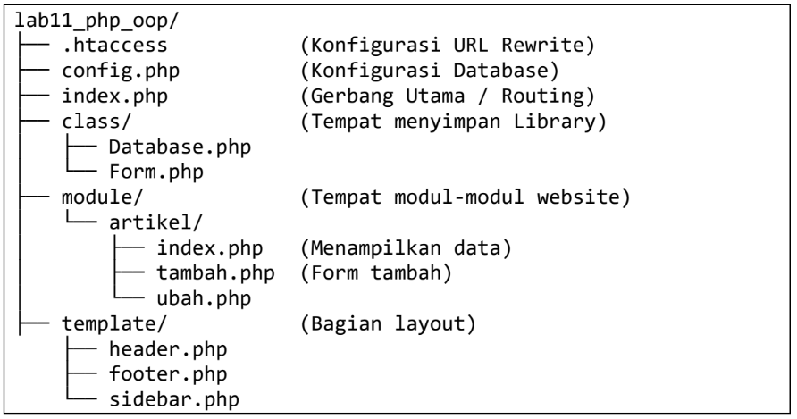

Langkah 1: Pindahkan file Database.php dan Form.php (dari praktikum sebelumnya) ke
dalam folder class/.

- File: form.php

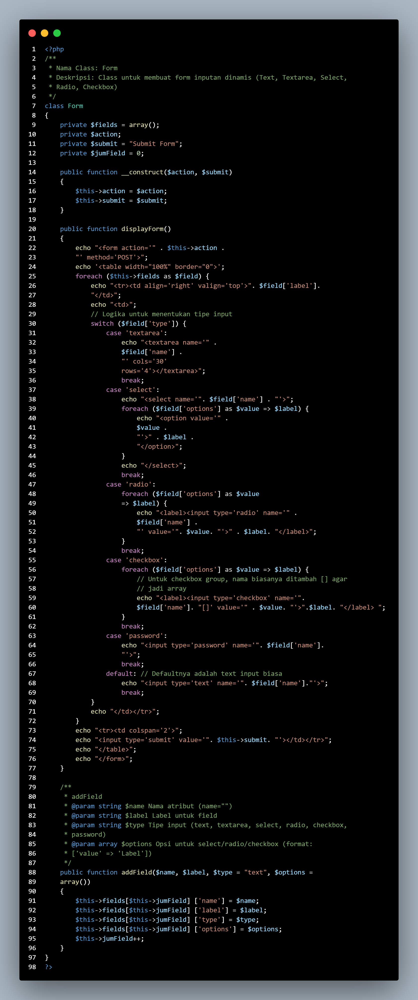

- File: database.php

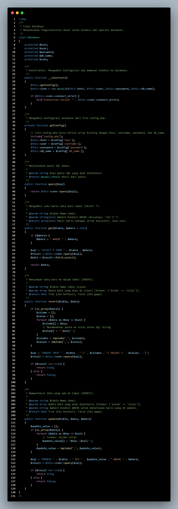

- B. Konfigurasi Dasar

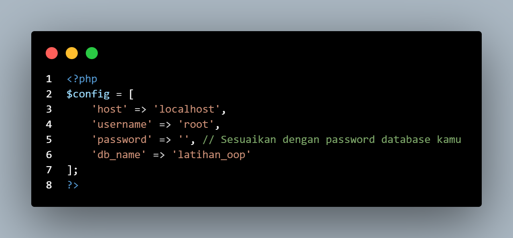

**Tugas & Implementasi**

Implementasikan konsep modularisasi dari praktikum sebelumnya dan terapkan konsep
routing pada project yang baru.

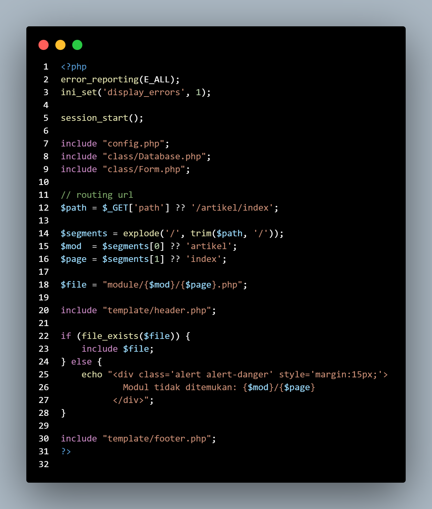

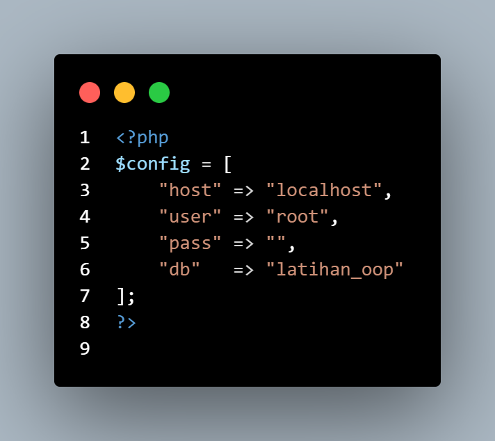

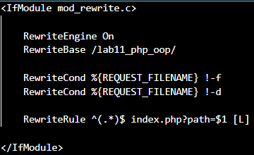

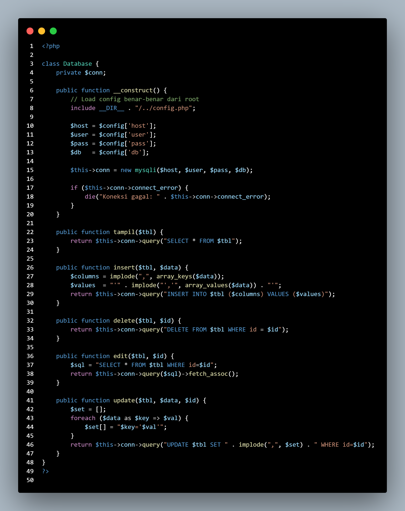

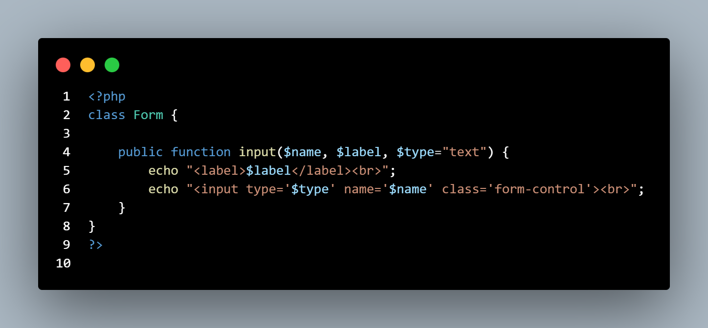

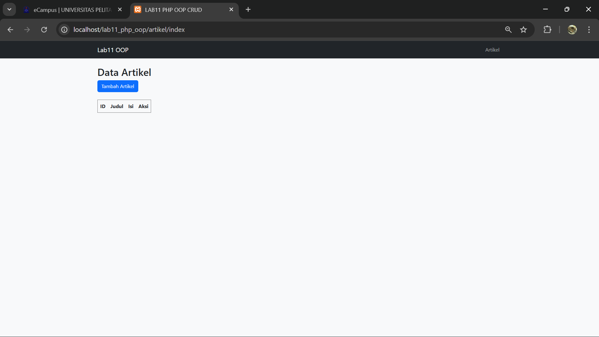

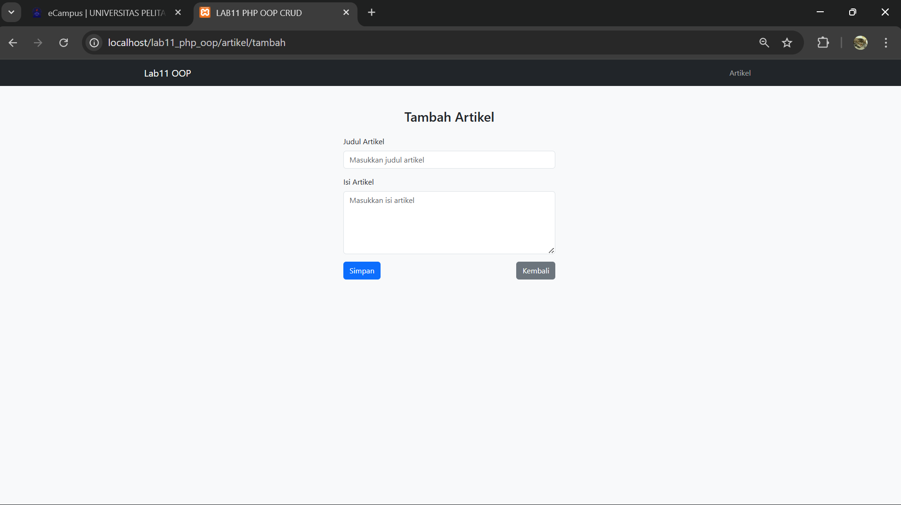
